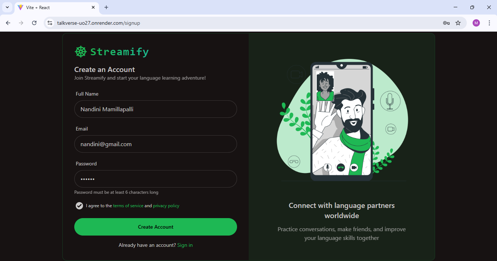
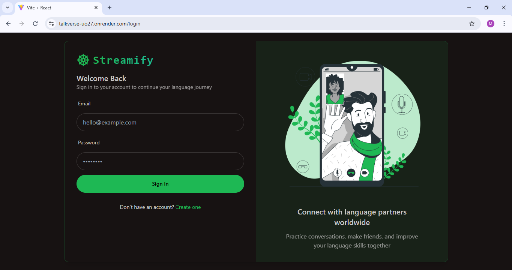
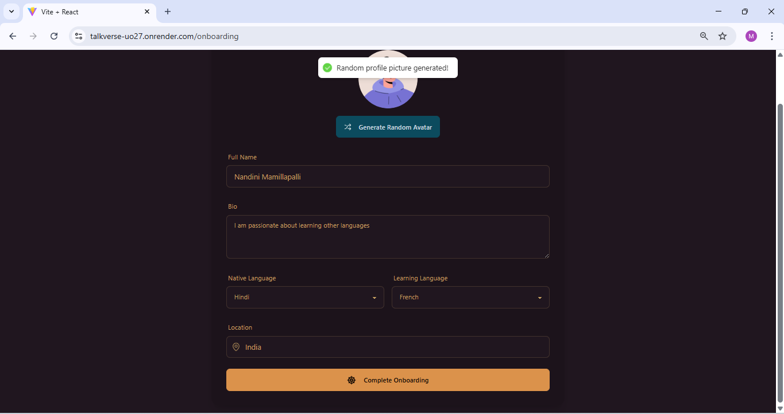
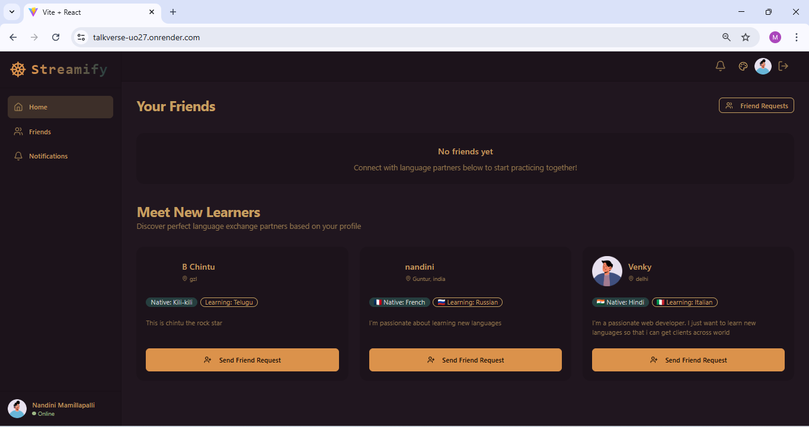
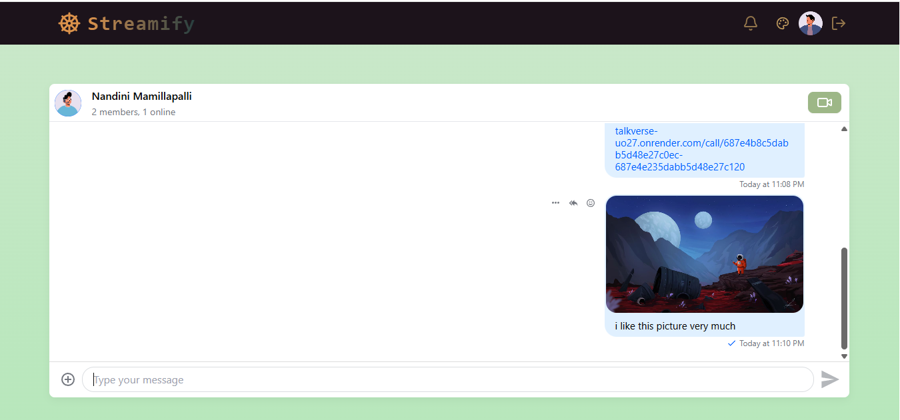
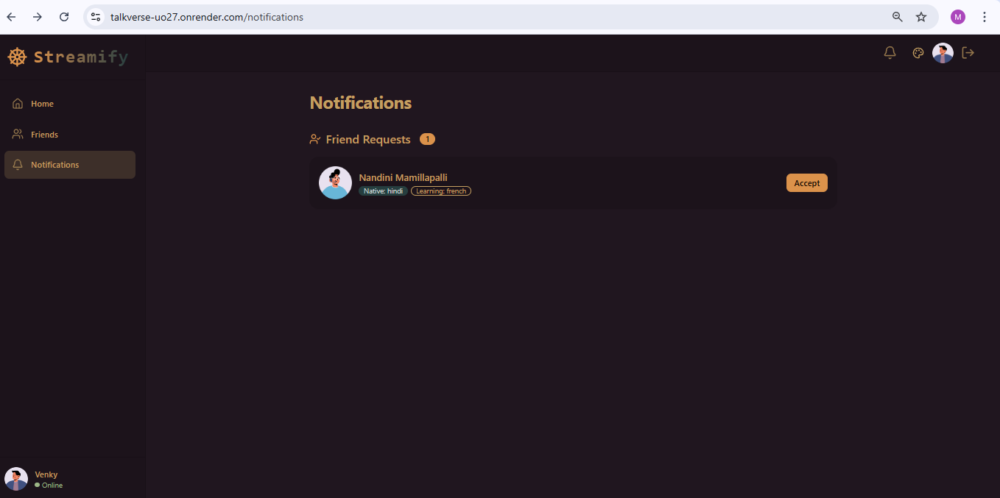

# 💬 TalkVerse

**TalkVerse** is a modern full-stack chat/web communication platform built with the **MERN stack** (MongoDB, Express, React, Node.js). It includes robust architecture with modular folders and organized state management using custom hooks and a store.

🚀 [Live Demo](https://talkverse-uo27.onrender.com)

---

## 📁 Project Structure

```
TALKVERSE/
├── backend/
│   ├── src/
│   │   ├── controllers/
│   │   ├── lib/
│   │   ├── middleware/
│   │   ├── models/
│   │   ├── routes/
│   │   └── server.js
│   ├── .env
│   ├── package.json
│   └── package-lock.json
│
├── frontend/
│   ├── public/
│   ├── src/
│   │   ├── components/
│   │   ├── constants/
│   │   ├── hooks/
│   │   ├── lib/
│   │   ├── pages/
│   │   ├── store/
│   │   ├── App.jsx
│   │   ├── index.css
│   │   └── main.jsx
│   ├── .env
│   ├── index.html
│   ├── package.json
│   ├── tailwind.config.js
│   ├── postcss.config.js
│   └── vite.config.js
```

---

## ⚙️ Tech Stack

**Frontend:**
- React
- Vite
- Tailwind CSS
- Custom Hooks & State Store
- Axios

**Backend:**
- Node.js
- Express.js
- MongoDB (with Mongoose)
- Environment-based config
- Modular route & controller handling

**Deployment:**
- Render for hosting (frontend + backend)
- MongoDB Atlas for cloud database

---

## 🧩 Features

- 🔐 User Authentication JWT token.
- 💬 Real-time or Async Messaging Logic
- 🗃️ Modular Folder Architecture
- ♻️ Reusable Components and Hooks
- 🛡️ Middleware for Error Handling & Security
- 🌐 API Integration between Frontend & Backend
- 📦 Fully Deployed with Environment Config

---

## 🚀 Getting Started

### ✅ Prerequisites
- Node.js v16+
- MongoDB Atlas URI
- Vite CLI (for frontend)

---

### 🔧 Backend Setup

```bash
cd backend
```

Create a `.env` file in the `backend/` directory:

```env
PORT=5001
MONGODB_URI=your_mongodb_connection_string
JWT_SECRET=some_super_secret_key

STREAM_API_KEY=your_stream_key
STREAM_API_SECRET=your_stream_secret
STREAM_APP_ID=your_stream_app_id
```

Start backend server:

```bash
npm install
npm run dev
```

---

### 🌐 Frontend Setup

```bash
cd frontend
npm install
npm run dev
```

> Make sure your `.env` contains the correct backend API URL.

---

## 🌍 API Endpoints

| Method | Endpoint                      | Description                            |
|--------|-------------------------------|----------------------------------------|
| POST   | `/api/auth/register`          | Register a new user                    |
| POST   | `/api/auth/login`             | Login user                             |
| GET    | `/api/users`                  | Get all users (with optional search)   |
| GET    | `/api/users/:id`              | Get a specific user profile by ID      |
| POST   | `/api/chats`                  | Access or create one-to-one chat       |
| GET    | `/api/chats`                  | Get all user chats                     |
| POST   | `/api/chats/group`            | Create a new group chat                |
| POST   | `/api/messages`               | Send a new message                     |
| GET    | `/api/messages/:chatId`       | Fetch all messages in a chat           |

---

## 🖼️ Screenshots

### 📝 SignUp Interface


### 🔐 Login Page


### 🧭 Onboarding Interface


### 🏠 Home Page


### 💬 Chat Interface


### 🔔 Notifications Page



---

## 📦 Deployment

The project is fully deployed on **Render**:

🔗 [TalkVerse Live](https://talkverse-uo27.onrender.com)

---

## 🙌 Acknowledgments

- [React](https://reactjs.org/)
- [MongoDB Atlas](https://www.mongodb.com/cloud/atlas)
- [Tailwind CSS](https://tailwindcss.com/)
- [Vite](https://vitejs.dev/)
- [Render](https://render.com/)

---

## 👨‍💻 Author

Made with ❤️ by Nandini Mamillapalli

---
